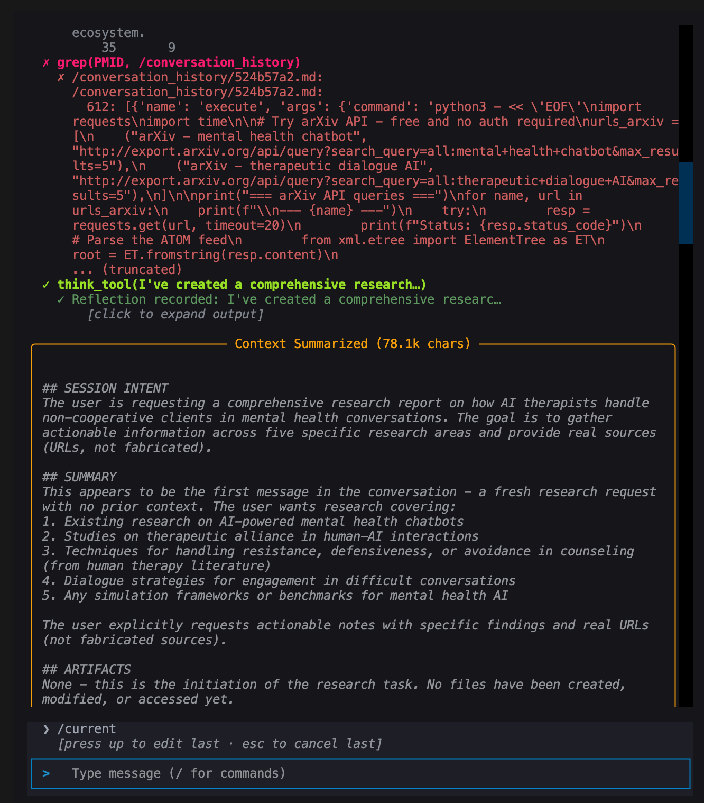

# 📘 EvoSci Exploration: Handling Resistance in AI Therapy

## 1. Overview  

This repository documents an exploratory use of **EvoSci (research agent)**.

The goal was to examine:

> How far a research agent can go from a single prompt to structured research outputs

Specifically, I asked EvoSci to study:

> *How AI therapists handle non-cooperative clients in mental health conversations, with a focus on simulation and evaluation.*

---

## 2. Setup  

EvoSci installation and usage:  
👉 https://github.com/EvoScientist/EvoScientist

---

## 3. Workflow  

### Step 1 — Prompt  

The experiment starts from a **single prompt**:

---

### Step 2 — Agent Execution  

The agent then runs autonomously:

From this process:

- The task is automatically decomposed  
- A multi-step pipeline is executed (~28 tools)  
- External sources are queried (e.g., arXiv API)  
- Large context is summarized (~78k characters)  
- Structured artifacts are generated  

👉 In practice, EvoSci behaves like a **research assistant performing literature review + system design + implementation**

---

## 4. Outputs  

EvoSci generated the following artifacts:

---

### 📊 Benchmark Dataset  
`artifacts/benchmark_dataset.json`  

- 50 simulated therapy scenarios  
- Multiple types of non-cooperative clients  
- Includes context, responses, and target strategies  

---

### 🧠 Simulation Framework  
`artifacts/resistance_simulation.py`  

- Defines resistance archetypes  
- Includes strategy definitions (e.g., MI-inspired)  
- Supports LLM-based and rule-based responses  

---

### 🧪 Benchmark Pipeline  
`artifacts/run_benchmark.py`  

- Runs all scenarios  
- Generates responses  
- Evaluates outputs  

---

### 📈 Benchmark Results  
`artifacts/benchmark_report.json`  

- Aggregated performance metrics  
- Per-category evaluation  

---

### 📄 Conceptual Framework  
`artifacts/simulation_framework.md`  

- High-level design of:
  - resistance modeling  
  - strategy space  
  - evaluation  

---

### 📑 Research Report  
`report/research_report_non_cooperative_ai_therapy.md`  

- Literature-based synthesis generated by EvoSci  
- Covers:
  - AI mental health systems  
  - therapeutic alliance  
  - resistance handling strategies  
  - evaluation approaches  

---

### 📝 Logs  
`artifacts/benchmark_run.log`  

- Execution trace  
- Includes API errors and fallback behavior  

---

## 5. Key Observation  

All artifacts above were generated from **a single prompt**.

EvoSci was able to:

- Structure a research problem  
- Design a simulation framework  
- Generate dataset + code + evaluation  
- Run a benchmark pipeline  

👉 This results in a **complete prototype research workflow**

---

## 6. Limitations  

- Execution is not fully stable (e.g., API quota errors)  
- Evaluation and “ground truth” are not validated  

👉 Human interpretation remains necessary  

---

## 7. Cost  

Total API usage:

> ~3.08M tokens (MiniMax-M2.5)  
> ~¥4.07 (～€0.52)

---

## 8. Takeaway  

> EvoSci does not replace research,  
> but it can rapidly generate a **full experimental scaffold** from a single idea.
